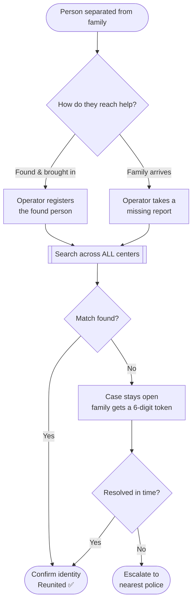
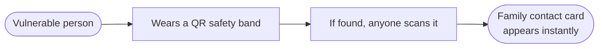

# 🪔 Kumbh Setu

### A bridge to reunite families separated at the Kumbh Mela

---

## 🧭 The problem

> At the Kumbh Mela, tens of millions of pilgrims gather in one place. **Thousands are separated from their families every day**, most often elderly pilgrims and young children.

The traditional lost-and-found process is slow and fragmented. A person found at one center is **invisible** to a family searching at another. Kumbh Setu closes that gap with one shared system that searches **every center at once** and is built for people with **no phone, no app, and no need to read more than a few digits**.

---

## 🔄 How it works

---

## 👥 Who it is for

| Role | What they do |
| --- | --- |
| 👨‍👩‍👧 **Families** | Report a missing relative and check status with a simple token |
| 🧑‍💼 **Operators** | Register people, run searches, confirm matches at a center |
| 🤝 **Volunteers** | Bring distressed people to the nearest center |
| 🛰️ **Administrators** | Monitor the live picture and plan where help is needed |

---

## 🧩 Features

| Area | Highlights |
| --- | --- |
| 🔍 **Find & match** | Search every center at once · live similarity prediction with a match score · smart search by description · cross-center matching that closes both records together |
| 👨‍👩‍👧 **For families** | A 6-digit token to check status anywhere, anytime, with no phone or app · optional name, photo, and last-seen details |
| 🗂️ **Operations** | Case dashboard with search and filters · aging-case flags · one-tap escalation to the nearest police · hospital-transfer recording |
| 📊 **Oversight** | Live counts · coverage map · busiest "rush" areas · pending-case breakdown · zone-wise statistics |
| 🌐 **Access** | Multilingual interface · voice input in the family's language · designed to keep working in tough, low-connectivity conditions |

---

## 🪪 Safety band for extreme cases

For people who cannot give their own details (small children, those with dementia), a religious band carries a small QR code.

---

## 🔒 Privacy and responsible use

- 🟢 **Privacy by design** — a name is optional, and status reaches families only through a token.
- 🟢 **Human in the loop** — matching is decision support, never proof. An operator always confirms identity before a case is closed.
- 🟢 **No real data** — every record in this prototype is synthetic. No real personal information is present.

---

## 🚧 Project status

A working prototype that demonstrates the full end-to-end experience on sample data, built as a foundation to grow into a real deployment.

*Built for the Claude Impact Lab, Mumbai 2026.*

